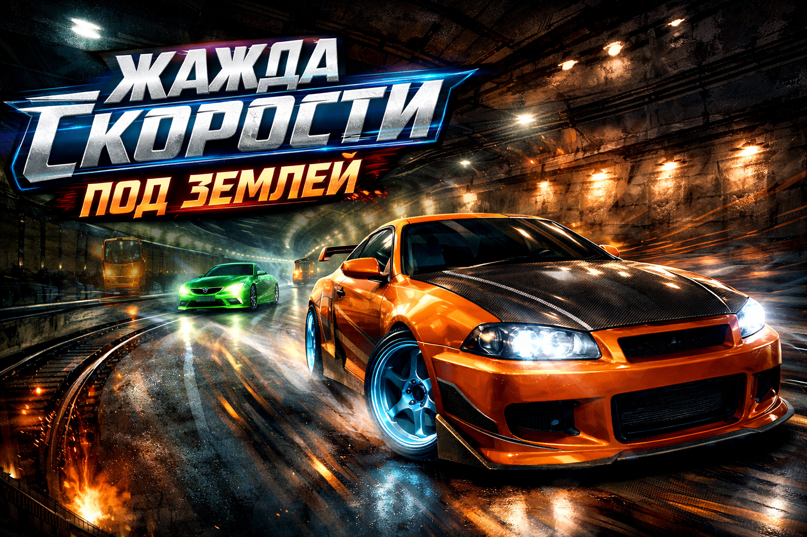

<p align="center">
  
</p>

# OSM Racing

3D гоночная игра на движке Godot 4 с загрузкой карт из OpenStreetMap.

## Запуск игры

### Правильный способ запуска

```bash
# Из командной строки - БЕЗ указания сцены:
/Applications/Godot.app/Contents/MacOS/Godot --path /путь/к/osm-racing

# Или просто открыть проект в Godot и нажать F5
```

### НЕЛЬЗЯ запускать напрямую main.tscn:

```bash
# НЕПРАВИЛЬНО! Это сломает меню:
/Applications/Godot.app/Contents/MacOS/Godot --path . res://main.tscn
```

## Архитектура меню (NFS Underground стиль)

```
standalone_main_menu.tscn  <── Точка входа (project.godot → run/main_scene)
├── Анимированный фон
├── Выбор города (Череповец)
├── Выбор режима (свободная езда / гонка)
└── Загружает main.tscn при старте игры
```
