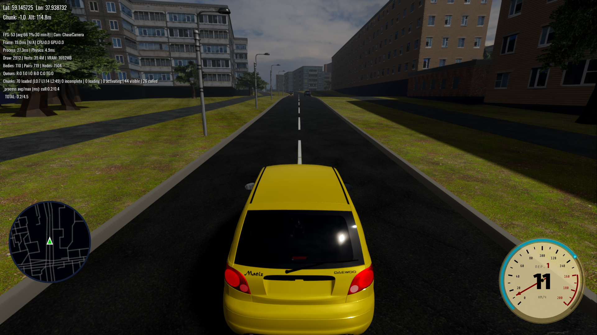
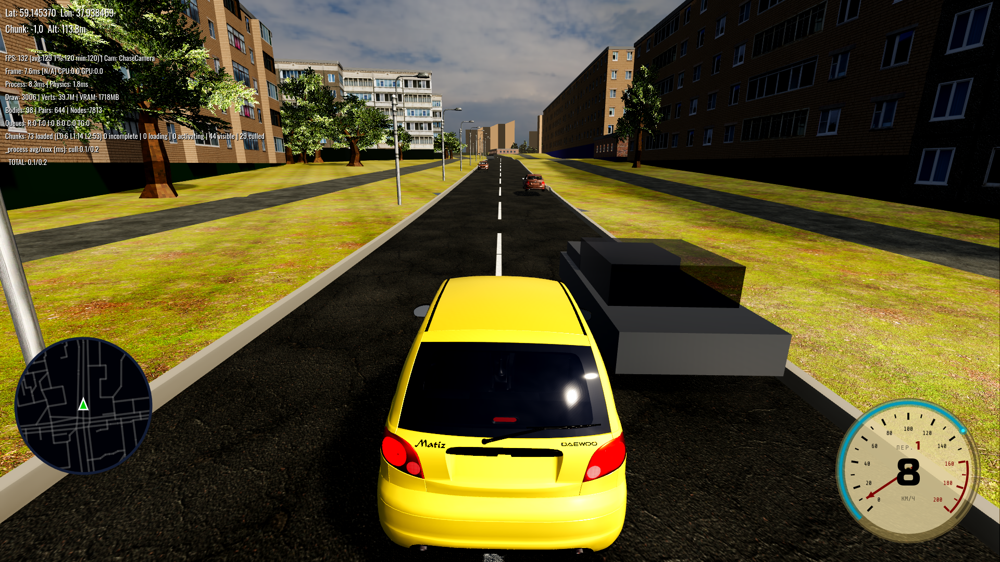
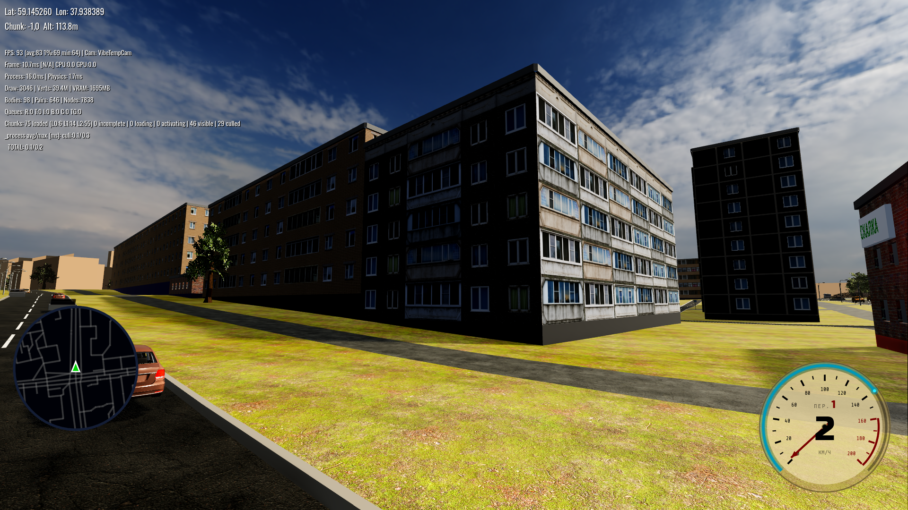
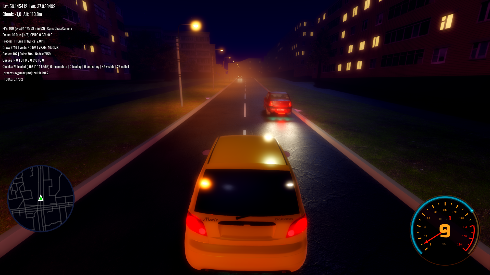

# Soviet / Post-Soviet Vibe — Results

Outcome of the visual-direction pass defined in [SOVIET_VIBE_PLAN.md](SOVIET_VIBE_PLAN.md).
Target reference: [example.png](example.png). All work verified in-engine at a dense
residential Cherepovets block (spawn `59.146174 / 37.939085`).

## Before → After

| Before (baseline) | After (final) |
|---|---|
|  |  |
| cold, flat, milky grey haze; pale blown sky; uniform clean buildings; neon-white markings | warm directional sun; readable shadow form; blue sky; tonally-varied weathered panel blocks; worn markings; balanced exposure |

Close-up of the panel blocks (per-building tint + weathering, readable shaded faces):

Night mode (unchanged feature, verified intact through all the day-side changes):

### Progression
- Baseline: [vibe_baseline_02.png](../screenshots/vibe_baseline_02.png)
- After atmosphere/light re-grade: [vibe_phase2_01.png](../screenshots/vibe_phase2_01.png)
- After weathering + shade-fill: [vibe_phase3c_spawn.png](../screenshots/vibe_phase3c_spawn.png)
- Final (exposure + anti-shimmer + mipmaps): [vibe_final_spawn.png](../screenshots/vibe_final_spawn.png) · [vibe_final_closeup.png](../screenshots/vibe_final_closeup.png)

## What changed (and why)

### 1. Atmosphere & lighting — the dominant win
- Ambient: flat grey `Color` → **sky-based** ambient (energy 1.0) so shaded sides pick up sky/bounce instead of dead grey.
- Sun: white @1.0 → **warm `(1,0.95,0.86)` @1.3** + `light_angular_distance 0.6` (soft shadow edge), giving readable form.
- Tonemap: Filmic/white 5.0 → **ACES, white 4.0, exposure 0.9** — punchier and no milky highlights.
- Fog: cool blue, dense, `aerial 0.7` → **warm `(0.82,0.78,0.68)`, thin** (`0.4/render_distance`, aerial 0.4) — clear foreground, warm haze only far away.
- **Day volumetric fog disabled** (was a milky white veil over the whole frame).
- Files: [main.tscn](../main.tscn), [race/race_scene.tscn](../race/race_scene.tscn), runtime fog override [osm_terrain_generator.gd:19253](../osm/osm_terrain_generator.gd#L19253), [graphics_settings.gd:193](../settings/graphics_settings.gd#L193).

### 2. Removed washout-and-cost effects (perf-positive)
- **SSR off** (incl. the saved `user://graphics.cfg` that was overriding the default), **SSIL off**, **SDFGI off** in the race scene. **SSAO kept** (cheap contact shadows). Frees GPU and removes flattening/haze.

### 3. Procedural weathering + per-building variation (scales to the whole world)
- World-space noise in [facade_111_125.gdshader](../osm/facade_111_125.gdshader) (FacadeAssembler panels: brown/pear/pebble/concrete/brick/teal) and [building_wall.gdshader](../osm/building_wall.gdshader) (fallback boxes): per-building tonal + warm↔cool tint, vertical water streaks, grunge, slight desaturation. Opt-in `weather_strength` (0 by default → curbs/parapets/fences stay clean; 0.6 on wall + recess materials).
- Ambient re-tuned so shaded faces don't crush to black.

### 4. Materials
- Worn markings: pure white `(1,1,1)` → **`(0.8,0.79,0.73)`** (gen lines 5455/6820).
- Asphalt: world-space patch/stain wear in [wet_road.gdshader](../shaders/wet_road.gdshader).

### 5. Anti-shimmer (texture/specular aliasing) — found via the streetlight "trail" clue
- **TAA off** — it was leaving ghosting trails on the building behind a moving lamp post (disocclusion) and only smearing over aliasing. Replaced with **MSAA 4× + anisotropic + FXAA off**.
- **Anisotropic filtering** enabled on all world shaders (road/ground/walls/facades) — they were `filter_linear_mipmap` (no anisotropic), shimmering at grazing angles.
- **Mipmaps enabled** on every world-surface texture (138 FacadeAssembler atoms + 94 building/wall/road/grass textures) — they were imported with `mipmaps/generate=false`, so mip/anisotropic filtering had nothing to sample. This was the root cause of the facade + grass + default-texture shimmer.
- Lower SPECULAR on matte concrete (facade 0.2, wall 0.25); reduced procedural-noise frequency so it doesn't alias.

### 6. Bug fixes found while testing
- **Load-hang fix**: `_apply_road_result` assigned a possibly-freed chunk `parent` to a typed `Node3D`, raising "invalid previously freed instance" which tripped the editor's break-on-error and froze generation. Now fetched untyped → validated → narrowed ([osm_terrain_generator.gd:5065](../osm/osm_terrain_generator.gd#L5065)).
- **Night→day restore**: `night_mode_manager` now captures/restores `volumetric_fog_enabled` and ambient color/energy, so a night cycle no longer resets the new day grade.

## Performance
Vsync-off, dense block: ~110–120 FPS, draws ~2.3–3.2k (NPC-dependent), no regression vs baseline. SSR/SSIL/SDFGI removal offsets MSAA 4× + anisotropic. (macOS Low Power Mode caps to 60 — measure with vsync off.)

## Deferred / not done
- **Phase 4 — raised curbs / concrete sidewalk** (geometry): curbs were intentionally zeroed for every road class; the sidewalk-junction curb system has 8 documented failed attempts ([curb_junction_debug](../memory/curb_junction_debug.md)) and the bridge-seam rule applies. High risk, deferred.
- **Phase 6 — clutter/vegetation density** and **Phase 7 — sky cumulus clouds**: optional polish, not started. (Day sky is the cloudless `day_clear_2k.hdr` panorama, which also drives ambient — a cloud swap needs sun/exposure care.)
