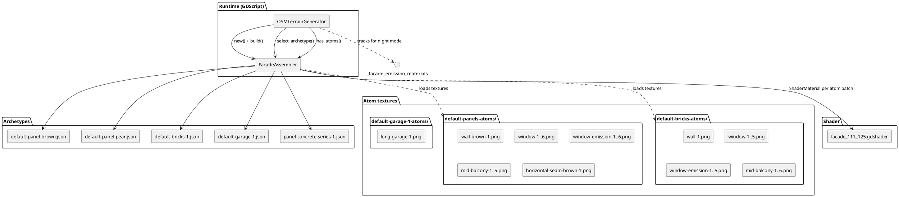
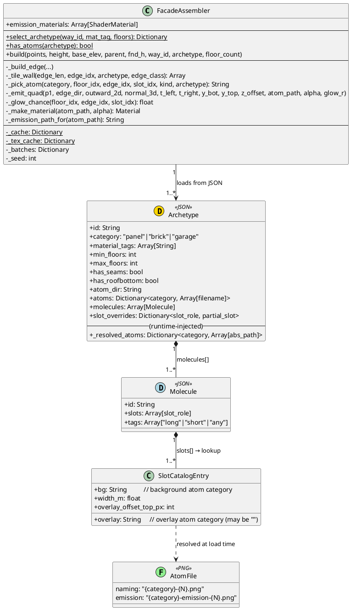
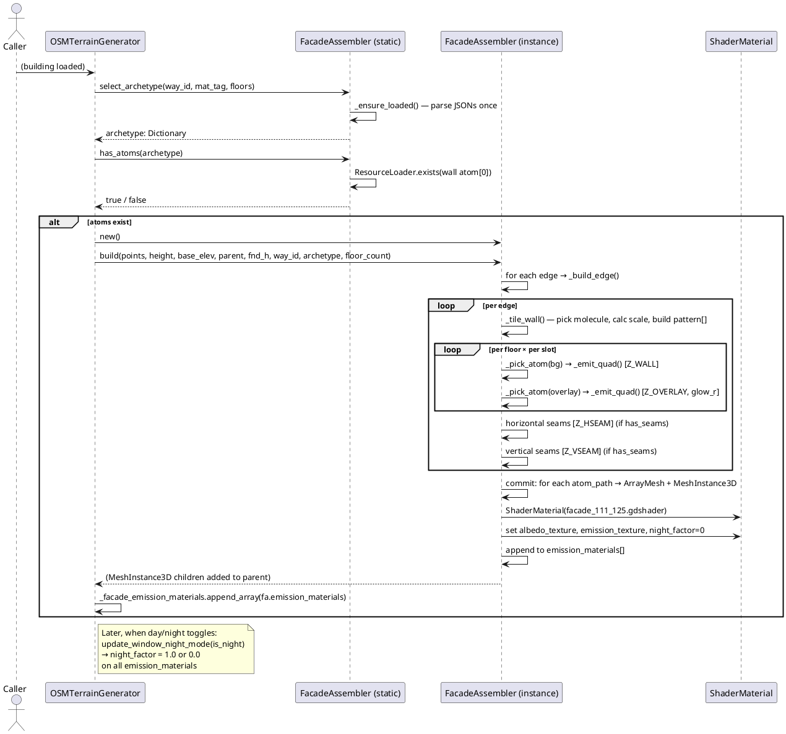
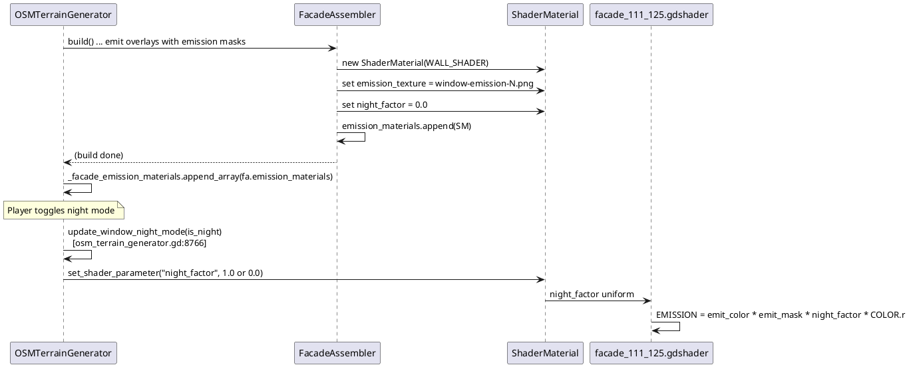

# Facade Assembler — Architecture Reference

Procedural facade system that tiles pixel-art atoms across building edges using
molecule patterns driven by archetype JSON configs.

---

## Table of Contents

1. [Concept Hierarchy](#concept-hierarchy)
2. [Component Diagram](#component-diagram)
3. [Data Model (Class Diagram)](#data-model-class-diagram)
4. [Build Call Flow (Sequence Diagram)](#build-call-flow-sequence-diagram)
5. [Archetype JSON Schema](#archetype-json-schema)
6. [SLOT_CATALOG Reference](#slot_catalog-reference)
7. [Molecule Fitting Algorithm](#molecule-fitting-algorithm)
8. [Edge Long / Short Classification](#edge-long--short-classification)
9. [Atom Naming Convention](#atom-naming-convention)
10. [Emission Mask Convention](#emission-mask-convention)
11. [Night Mode Pipeline](#night-mode-pipeline)
12. [Call Site in OSMTerrainGenerator](#call-site-in-osmterraingenerator)
13. [Adding a New Archetype](#adding-a-new-archetype)

---

## Concept Hierarchy

```
Archetype  ← one JSON file, one visual style (e.g. "brown panel block")
  └─ Molecule[]  ← one repeating bay pattern (e.g. "window + balcony + window")
       └─ Slot[]  ← one column section (e.g. "window" = wall bg + window overlay)
            └─ Atom  ← one PNG texture file (e.g. "window-3.png")
```

**Archetype** selects *which* molecules are available and *which* textures to use.
**Molecule** is a horizontal sequence of slots tiled N times to fill an edge.
**Slot** has a background atom category and an optional overlay atom category.
**Atom** is the actual PNG. Multiple atoms per category → random deterministic pick.

---

## Component Diagram



---

## Data Model (Class Diagram)



---

## Build Call Flow (Sequence Diagram)



---

## Archetype JSON Schema

File location: `res://decorations/russia/cherepovets/facades/*.json`
Code: [`osm/facade_assembler.gd:534`](../osm/facade_assembler.gd#L534) `_ensure_loaded()` / `_resolve_atoms()`

```jsonc
{
  // ── Identity ─────────────────────────────────────────────────────────────
  "id": "default-panel-brown",        // unique string; used for deterministic
                                       // selection (sort key)
  "category": "panel",                // "panel" | "brick" | "garage"
                                       // mapped from building:material tag
  "material_tags": ["panel","large_panel"],  // OSM tags that route here

  // ── Floor range filter ────────────────────────────────────────────────────
  "min_floors": 4,                    // inclusive. Default 1.
  "max_floors": 20,                   // inclusive. Default 99.

  // ── Feature flags ─────────────────────────────────────────────────────────
  "has_seams": true,                  // emit horizontal + vertical seam quads
  "has_roofbottom": false,            // emit crown band above top floor

  // ── Textures ──────────────────────────────────────────────────────────────
  "atom_dir": "res://decorations/russia/cherepovets/default-panels-atoms/",
  "atoms": {
    // key = atom category name (matches SLOT_CATALOG bg/overlay fields)
    // value = array of base filenames (no extension); resolved to atom_dir+name+".png"
    "wall":        ["wall-brown-1"],
    "mid-wall":    ["mid-wall-brown-1"],
    "window":      ["window-1", "window-2", "window-3"],
    "mid-balcony": ["mid-balcony-1", "mid-balcony-2"],
    "horizontal-seam":      ["horizontal-seam-brown-1"],
    "horizontal-mid-seam":  ["horizontal-mid-seam-brown-1"],
    "horizontal-long-seam": ["horizontal-long-seam-brown-1"],
    "vertical-seam":        ["vertical-seam-brown-1"]
    // Cross-archetype atoms (different dir): use {dir, files} form:
    // "window": {"dir": "res://other/atoms/", "files": ["window-1"]}
  },

  // ── Slot overrides ────────────────────────────────────────────────────────
  // Merge-overrides specific SLOT_CATALOG fields for this archetype only.
  "slot_overrides": {
    "window":     {"overlay_offset_top_px": 0},  // bricks: window flush with top
    "mid-window": {"overlay_offset_top_px": 0}
  },

  // ── Molecules ─────────────────────────────────────────────────────────────
  "molecules": [
    {
      "id": "win-midbal-win",          // must be unique within file
      "slots": ["window", "mid-balcony", "window"],
      "tags": ["any"]                  // "long" | "short" | "any"
                                        // See Edge Classification section
    },
    {
      "id": "long-garage-door",
      "slots": ["long-garage"],
      "tags": ["long"]                 // only on long edges
    }
  ]
}
```

### `category` → `building:material` mapping

Code: [`osm/facade_assembler.gd:580`](../osm/facade_assembler.gd#L580) `_tag_to_category()`

| OSM `building:material` | `category` |
|---|---|
| `panel`, `large_panel` | `panel` |
| `brick` | `brick` |
| `garage` *(injected by caller)* | `garage` |
| anything else | *(skipped)* |

Buildings without `building:material` get a deterministic 40% brick / 60% panel
assignment: [`osm_terrain_generator.gd:9434`](../osm/osm_terrain_generator.gd#L9434)
```gdscript
var h := (way_id * 2654435761) & 0xFFFF
mat_tag = "brick" if h < 26214 else "panel"  # 26214/65536 ≈ 40%
```
`building=garages` or `building=garage` forces `mat_tag = "garage"`.

---

## SLOT_CATALOG Reference

Code: [`osm/facade_assembler.gd:22`](../osm/facade_assembler.gd#L22)

| Slot role | Background atom | Overlay atom | Width (m) | Overlay top offset (px) |
|---|---|---|---|---|
| `wall` | `wall` | — | 3.2 | 0 |
| `mid-wall` | `mid-wall` | — | 4.8 | 0 |
| `long-wall` | `long-wall` | — | 6.4 | 0 |
| `window` | `wall` | `window` | 3.2 | 80 |
| `mid-window` | `mid-wall` | `mid-window` | 4.8 | 80 |
| `mid-balcony` | `mid-wall` | `mid-balcony` | 4.8 | 0 |
| `long-balcony` | `long-wall` | `long-balcony` | 6.4 | 0 |
| `roofbottom` | `roofbottom` | — | 3.2 | 0 |
| `long-roofbottom` | `long-roofbottom` | — | 6.4 | 0 |
| `long-garage` | `long-wall` | `long-garage` | 6.4 | 0 |

**Overlay placement** (`overlay_offset_top_px = 80`):
The overlay is placed flush with `y_top − offset`, then sized downward from the
overlay's native pixel dimensions. Windows have an 80 px gap at the top (≈0.5 m
at `NOMINAL_FLOOR_PX=512`). Balconies and garage doors have offset 0 so they
extend from the top edge down.

Overlay width scales with the actual slot width (which may be stretched/compressed
when molecule scale ≠ 1.0): `ov_w_m = (tex.width / PX_PER_M) * slot_scale`.

`slot_overrides` in an archetype can change any of these fields per-archetype,
e.g. bricks set `overlay_offset_top_px: 0` so windows sit flush with the floor top.

---

## Molecule Fitting Algorithm

Code: [`osm/facade_assembler.gd:302`](../osm/facade_assembler.gd#L302) `_tile_wall()`

1. **Filter eligible molecules**: keep only molecules whose slots are not in
   `archetype.forbidden` and whose `tags` include `"any"` or the current
   `edge_class` (`"long"` or `"short"`).

2. **Sort deterministically** by `id` string (so platform file-system order
   doesn't affect results).

3. **Compute hash** for this edge: `h = (_seed * 12345 + edge_idx * 67891) & 0x7FFFFFFF`

4. **Scale fitness filter** — a molecule has width `mol_w = sum(slot.width_m)`.
   For integer repetitions `n = round(edge_len / mol_w)`:
   ```
   scale = edge_len / (n * mol_w)
   ```
   Keep the molecule in `fitting[]` if `scale >= 0.70` (≤30% compression or stretch).

5. **Pick from fitting[]**: `fitting[h % fitting.size()]`. If `fitting` is empty:
   - Try the smallest eligible molecule anyway.
   - If `scale < 0.50` (>50% compression): fall back to `_plain_wall_pattern()`
     — plain `wall` tiles with no overlay, at optimal repeat count.

6. **Build pattern[]**: repeat `slots` N times, compute cumulative
   `t_left` / `t_right` for each slot (in metres from edge start).

The molecule is identical on every floor of a given edge — only the atom
within each slot category changes per-floor/edge/slot via `_pick_atom()`.

---

## Edge Long / Short Classification

Code: [`osm/facade_assembler.gd:149`](../osm/facade_assembler.gd#L149) inside `build()`

```gdscript
var edge_class := "long" if edge_len >= minf(prev_len, next_len) else "short"
```

An edge is `"long"` if it is at least as long as the shorter of its two adjacent
edges. In practice:
- Long edges of rectangular buildings → `"long"` → garage doors and wide balcony
  molecules are eligible.
- Narrow return edges of L-shaped buildings → `"short"` → only plain-wall
  molecules run there.

The `tags` field in a molecule filters by this classification. Most molecules use
`"any"` to run everywhere; narrow-only or wide-only variants use `"short"` / `"long"`.

---

## Atom Naming Convention

```
{category}-{N}.png
```

Examples: `window-3.png`, `mid-balcony-5.png`, `wall-brown-1.png`,
`long-garage-1.png`, `horizontal-seam-brown-1.png`.

- `{category}` must match a key in `atoms` in the archetype JSON and a key in
  `SLOT_CATALOG`'s `bg` or `overlay` field.
- `{N}` is an integer starting at 1. Multiple N variants form the random pool.
- Atoms are picked deterministically per (floor_idx, edge_idx, slot_idx, kind)
  via a LCG hash seeded by `way_id`: [`facade_assembler.gd:415`](../osm/facade_assembler.gd#L415)

The `{dir, files}` atom form in JSON allows an archetype to pull atoms from
a different directory (e.g. sharing window variants across archetypes):
```json
"window": {"dir": "res://other/atoms/", "files": ["window-1", "window-2"]}
```

---

## Emission Mask Convention

```
{category}-emission-{N}.png
```

Example: `window-emission-3.png` is the emission mask for `window-3.png`.

- Must live in the **same directory** as the base atom.
- Grayscale PNG; R channel = glow intensity mask (white = glows, black = dark).
- `FacadeAssembler._emission_path_for()` reconstructs the path at runtime:
  [`facade_assembler.gd:504`](../osm/facade_assembler.gd#L504)
  ```
  "window-3.png" → "window-emission-3.png"
  ```
- If the file does **not** exist on disk, no emission texture is set and the
  atom does not participate in night mode.

### 30% random glow

Code: [`facade_assembler.gd:478`](../osm/facade_assembler.gd#L478) `_glow_chance()`

Only overlay atoms that have an emission mask participate. For each such quad,
`_glow_chance()` runs the same LCG as `_pick_atom` and returns `1.0` (glow) for
`(h % 100) < 30`, otherwise `0.0`. The result is written into the mesh
**vertex color R channel** (`COLOR.r` in the shader).

In the shader: `EMISSION = emit_color * emit_mask * night_factor * COLOR.r`
— the `COLOR.r = 0.0` suppresses emission on 70% of windows permanently,
regardless of `night_factor`. This is deterministic per building instance.

---

## Night Mode Pipeline



Shader uniforms: [`osm/facade_111_125.gdshader`](../osm/facade_111_125.gdshader)

| Uniform | Type | Default | Purpose |
|---|---|---|---|
| `albedo_texture` | sampler2D | — | Base wall/overlay texture |
| `emission_texture` | sampler2D | black | Emission mask |
| `night_factor` | float 0–1 | 0.0 | Night mode intensity (set by game) |
| `emit_color` | vec3 | `(1, 0.88, 0.55)` | Warm yellow window glow |
| `roughness_base` | float | 0.78 | PBR roughness |

---

## Call Site in OSMTerrainGenerator

Code: [`osm/osm_terrain_generator.gd:9419`](../osm/osm_terrain_generator.gd#L9419)

```gdscript
# ── FacadeAssembler gate ──────────────────────────────────────────────────
const FA_SKIP_TYPES := ["shed", "industrial", "warehouse", "retail",
        "commercial", "kiosk", "service", "roof", "carport", "barn", ...]

if _is_cherepovets_location() and building_type not in FA_SKIP_TYPES:
    # 1. Derive material category
    var mat_tag := str(tags.get("building:material", ""))
    if building_type in ["garages", "garage"]:
        mat_tag = "garage"
    elif mat_tag.is_empty():
        # 40 % brick / 60 % panel, deterministic per way_id
        mat_tag = "brick" if (way_id * 2654435761) & 0xFFFF < 26214 else "panel"

    # 2. Derive floor count
    var fa_floors := int(tags.get("building:levels", "0"))
    if fa_floors <= 0:
        fa_floors = maxi(2, roundi(building_height / 3.2))

    # 3. Select archetype + check atoms exist on disk
    var fa_arch := FacadeAssembler.select_archetype(way_id, mat_tag, fa_floors)
    if FacadeAssembler.has_atoms(fa_arch):
        # 4. Create blank collision mesh (FacadeAssembler adds visual only)
        _create_3d_building_with_custom_texture(..., BuildingOverride.new(), ..., true)

        # 5. Build facade
        var _fa := FacadeAssembler.new()
        _fa.build(points, building_height, base_elev, parent, fnd_h,
                  way_id, fa_arch, fa_floors)

        # 6. Track emission materials for night-mode updates
        _facade_emission_materials.append_array(_fa.emission_materials)
        fa_handled = true
```

`_is_cherepovets_location()` gates the system to Cherepovets coordinates only.
The fallback flat-texture path runs when `fa_handled = false` (missing atoms,
wrong building type, or outside the geo-gate).

### Night mode update

[`osm_terrain_generator.gd:8766`](../osm/osm_terrain_generator.gd#L8766) `update_window_night_mode(is_night)`  
Sets `night_factor` on every material in `_facade_emission_materials` (plus
pruning stale references). Called whenever the in-game day/night state changes.

---

## Adding a New Archetype

1. **Create atom textures** in a new (or existing) atoms directory.  
   Follow naming: `{category}-{N}.png`. Add `{category}-emission-{N}.png`
   alongside any overlay atom that should glow at night.

2. **Run Godot editor** once to generate `.import` files:
   ```bash
   /Applications/Godot.app/Contents/MacOS/Godot --editor --quit \
       --path /Users/alekseiaksenov/osm-racing
   ```

3. **Write the archetype JSON** in `decorations/russia/cherepovets/facades/`.
   - Pick a unique `id`.
   - Set `category`, `min_floors`, `max_floors`, `has_seams`, `atom_dir`.
   - List atom categories and filenames (no extension) in `atoms`.
   - Define `molecules` with meaningful `id` strings and correct `tags`.
   - Add `slot_overrides` if overlay positioning differs from SLOT_CATALOG defaults.

4. **Verify** `FacadeAssembler.has_atoms()` returns `true` by checking that
   at least one `wall` atom path resolves via `ResourceLoader.exists()`.

5. No code changes needed in `osm_terrain_generator.gd` — `select_archetype()`
   reads all JSONs from `ARCHETYPES_DIR` automatically on first call
   (`_ensure_loaded()`, [`facade_assembler.gd:534`](../osm/facade_assembler.gd#L534)).

### Checklist

- [ ] Atom PNGs created and placed in `atom_dir`
- [ ] Godot `--editor --quit` run to generate `.import` files
- [ ] JSON written with correct `id`, `category`, `atoms`, `molecules`
- [ ] `has_seams: true` if seam textures are provided (requires `horizontal-seam`,
      `horizontal-mid-seam`, `horizontal-long-seam`, `vertical-seam` atom categories)
- [ ] Emission masks added alongside overlay atoms that should glow at night
- [ ] `_tag_to_category()` in `facade_assembler.gd:580` maps the `building:material`
      value to your new category (add a new branch if needed)
